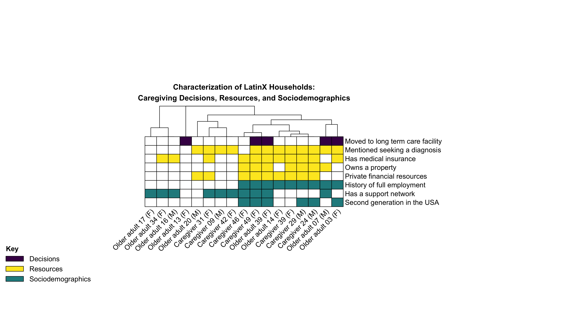
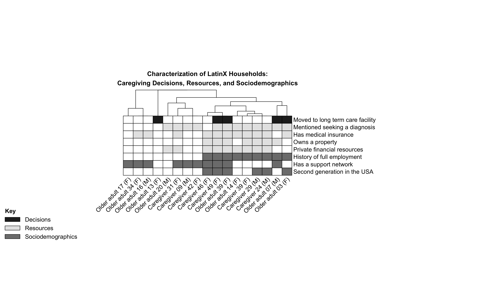

# Arteaga et al. (2025): Latinx household-characterization heatmap

Replication materials for the household-characterization heatmap in:

**Arteaga, Ignacia, Alma Hernandez de Jesus, Brandi Ginn, Corey M. Abramson, and Daniel Dohan (2025).** Understanding how social context shapes decisions to seek institutional care: a qualitative study of experiences of progressive cognitive decline among Latinx families. *The Gerontologist* 65(11):gnaf207.

| | |
|---|---|
| **Paper** | https://doi.org/10.1093/geront/gnaf207 |
| **Replication script** | `latinx_array_final.R` (also at [../latinx_array_final.R](../latinx_array_final.R), linked from the publication) |
| **Reproduction command** | `Rscript latinx_array_final.R` |
| **Software** | R; CRAN packages `pheatmap`, `lsa`, `viridisLite`, `colorspace`, `grid` |
| **Analytic dataset** | 8×17 case matrix (embedded in script; no external data file) |
| **Figure outputs** | `images/latinx_heatmap_color.png`, `images/latinx_heatmap_bw.png` (300 dpi) |
| **Supplements** | https://academic.oup.com/gerontologist/article/65/11/gnaf207/8256431#supplementary-data |
| **Machine-readable citation** | [CITATION.cff](CITATION.cff) |

## Quickstart

From this directory:

```bash
Rscript latinx_array_final.R
```

Missing CRAN packages install automatically on first run when CRAN is reachable. Committed PNGs in `images/` match a fresh run; re-run the script to regenerate them locally.

The publication cites `latinx_array_final.R` at the repository root. Run either copy from its own directory so outputs land in the matching `images/` folder.

## Citation

- DOI: https://doi.org/10.1093/geront/gnaf207
- Publisher page: https://academic.oup.com/gerontologist/article/65/11/gnaf207/8256431
- Machine-readable citation: [CITATION.cff](CITATION.cff)

## Figure crosswalk

| Manuscript output | Generated by | Output file |
|-------------------|--------------|-------------|
| Household-characterization heatmap (color) | `latinx_array_final.R` | `images/latinx_heatmap_color.png` |
| Household-characterization heatmap (grayscale-readable) | `latinx_array_final.R` | `images/latinx_heatmap_bw.png` |

## Figures

**Color heatmap**



**Grayscale-readable heatmap**



## Contents

| Path | Role |
|------|------|
| `latinx_array_final.R` | Replication script |
| `images/latinx_heatmap_color.png` | Color figure |
| `images/latinx_heatmap_bw.png` | Grayscale-readable figure |
| [CITATION.cff](CITATION.cff) | Machine-readable citation (software + associated article) |

## License

MIT — see [../LICENSE](../LICENSE). Copyright Corey M. Abramson.
